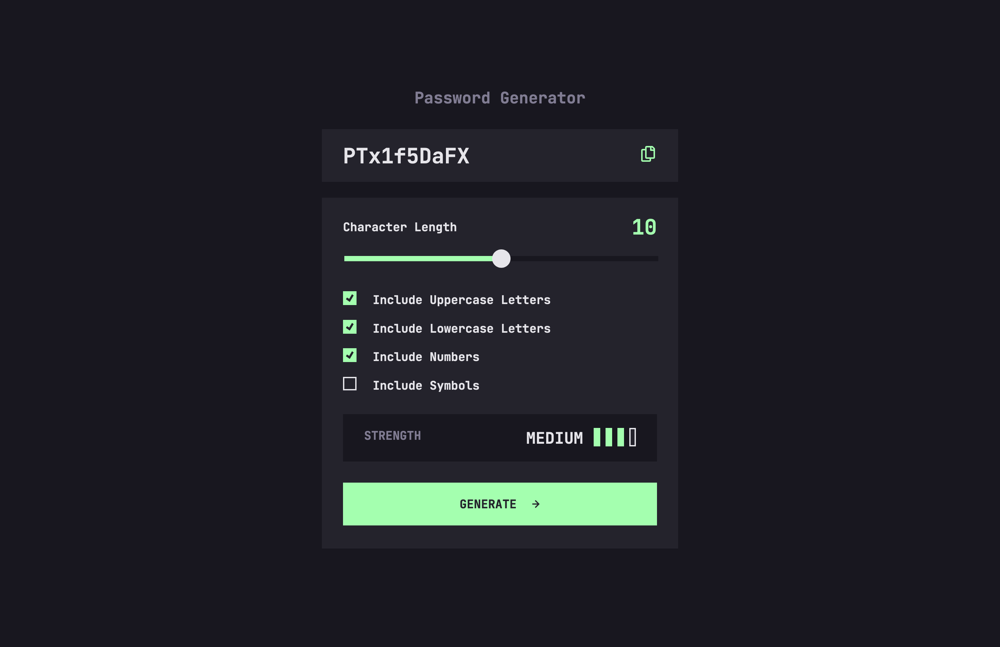

# Frontend Mentor - Password generator app solution

This is a solution to the [Password generator app challenge on Frontend Mentor](https://www.frontendmentor.io/challenges/password-generator-app-Mr8CLycqjh). Frontend Mentor challenges help you improve your coding skills by building realistic projects. 

## Table of contents

- [Overview](#overview)
  - [The challenge](#the-challenge)
  - [Screenshot](#screenshot)
  - [Links](#links)
- [My process](#my-process)
  - [Built with](#built-with)
  - [Useful resources](#useful-resources)
- [Author](#author)

## Overview

### The challenge

Users should be able to:

- Generate a password based on the selected inclusion options
- Copy the generated password to the computer's clipboard
- See a strength rating for their generated password
- View the optimal layout for the interface depending on their device's screen size
- See hover and focus states for all interactive elements on the page

### Screenshot

### Links

- Solution URL: [Add solution URL here](https://your-solution-url.com)
- Live Site URL: [Add live site URL here](https://your-live-site-url.com)

## My process

### Built with

- Semantic HTML5 markup
- Native CSS
- Vanilla JavaScript ES6
- Mobile-first workflow
- Custom checkbox styles
- Custom range input
- Form validation
- Custom formula to calculate the strength of the password

Checked with:

- Chrome Screen reader - for accessibility check
- Chrome Lighthouse
- PerfectPixel

### Useful resources

- [Generate Password Tutorial](https://youtu.be/1cdXwYEFDAg?si=fZj3hezVQNgf6cZ8) - I used this tutorial as idea how to generate the password.
- [Pseudo-random passwords](https://www.random.org/randomness/) - Explanation why not to use Math.random() method for generating real-world passwords, as they are only pseudo-random.
- [React Crypto](https://nodejs.org/api/crypto.html) - More secure way for creating passwords.
- [Cloud Connvert](https://cloudconvert.com/ttf-converter) - I use it to convert ttf font formats to light weight woff2 & woff.
- [Fluid Typography Tool](https://fluidtypography.com/#app-get-started) - I used it to calculate the font-size on smaller screen, to be fluid.
- [PX to REM converter](https://nekocalc.com/px-to-rem-converter) - I use it to convert pixel measures to rem units.
- [Copy text button](https://www.w3schools.com/howto/howto_js_copy_clipboard.asp)
- [restyle range](https://www.smashingmagazine.com/2021/12/create-custom-range-input-consistent-browsers/#focus-styles)
- [more restyle range](https://stackoverflow.com/a/57153340/23241334) - This solution helped me to style the "filled" part of the track (on the left)
- [restyle checkbox](https://moderncss.dev/pure-css-custom-checkbox-style/)
- [<system-color>](https://developer.mozilla.org/en-US/docs/Web/CSS/system-color) - about accessibility feature called forced colors mode
- [clip path tool](https://bennettfeely.com/clippy/)

## Author

- OrtalyARTS Portfolio Website - [@ortalyARTS.com](https://ortaly.com/)
- Frontend Mentor - [@ortalyARTS](https://www.frontendmentor.io/profile/ortalyARTS)
- Linkedin - [@ortalyARTS](www.linkedin.com/in/ortalyarts) 